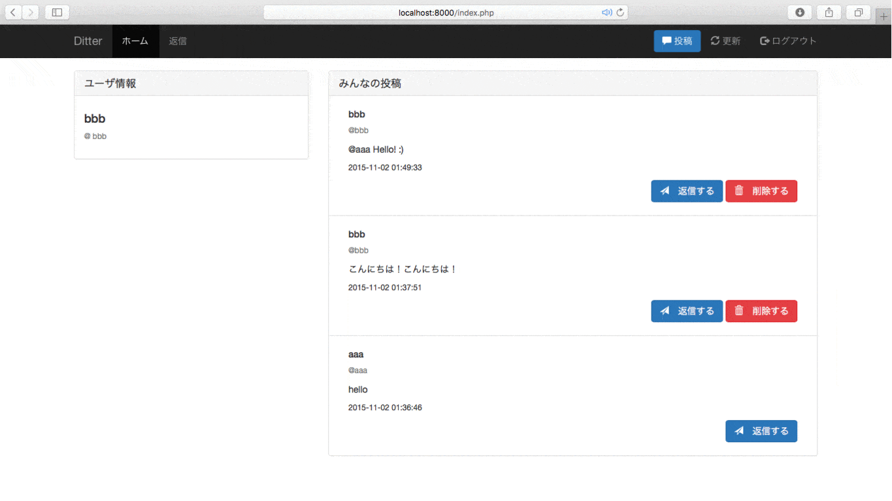
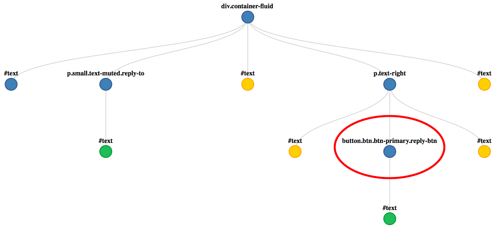
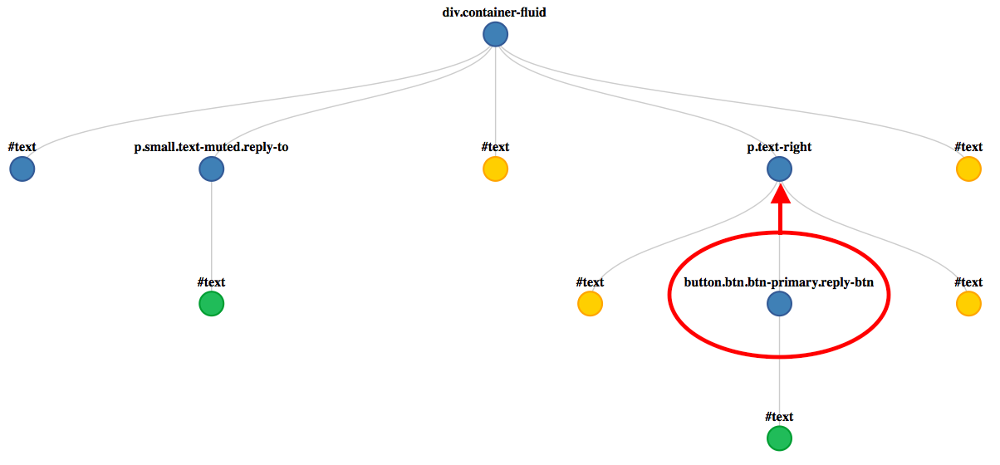
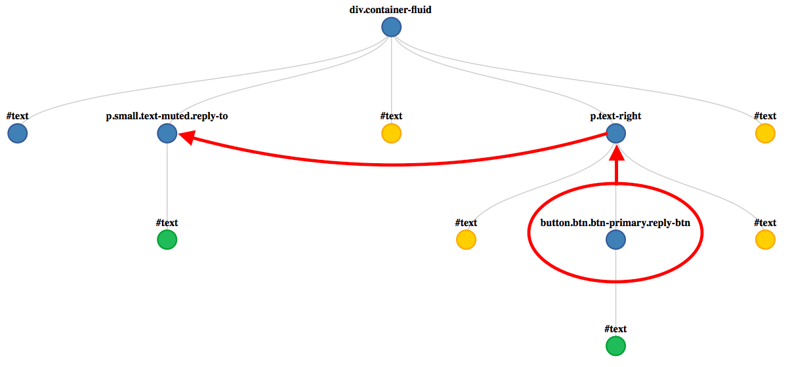

# 返信機能の実装
本稿では返信機能を実装します。

### 完成図


返信ボタンを押してモーダルウィンドウを表示し、
ウィンドウのテキストフィールドに返信相手のIDが挿入されたら完成です。

### 作成手順
1. 返信ボタンを押してモーダルウィンドウが出ることの確認
1. jQueryを使った返信先のIDの挿入

##  1. 返信ボタンを押してモーダルウィンドウが出ることの確認
まずは投稿一覧（`index.php`）を表示して`返信する`ボタンを押しましょう。
投稿用のモーダルウィンドウは表示されましたか？
表示されない場合は
[トップページの作成](https://github.com/dit-rohm/textbook/blob/master/autumn/makeIndexPage/addIndexPage.md)
に戻って`index.php`のHTML部分を再確認しましょう。

モーダルウィンドウが表示された方はindex.phpで
下記のソース部分を確認しましょう。
以下のソースは既に記述したモーダルウィンドウの表示部分と、返信ボタンの部分です。

#### index.php（モーダルウィンドウの部分）

```html
...
...
<!-- replyModal -->
<div class="modal fade" id="replyModal" tabindex="-1" role="dialog" aria-labelledby="replyModalLabel">
  <div class="modal-dialog" role="document">
    <div class="modal-content">
      <div class="modal-header">
        <button type="button" class="close" data-dismiss="modal" aria-label="Close">
          <span aria-hidden="true">&times;</span>
        </button>
        <h4 class="modal-title" id="replyModalLabel">リプライ</h4>
      </div>
      <div class="modal-body">
        <form action="index.php" method="post">
          <div class="form-group">
            <label for="replyText" class="control-label">メッセージ（140字まで）：</label>
            <textarea class="form-control" id="replyText" name="postText" maxlength="140"></textarea>
          </div>
          <button type="submit" class="btn btn-primary">返信する</button>
        </form>
      </div>
    </div>
  </div>
</div>
...
...
```
#### index.php（モーダルウィンドウを呼び出す部分）

```html
...
...
<button type="button" class="btn btn-primary reply-btn" data-toggle="modal" data-target="#replyModal">
  <span class="glyphicon glyphicon-send" aria-hidden="true"></span>　返信する
</button>
...
...
```

##  2. jQueryを使った返信先のIDの挿入
では本題です。
jQueryを使って返信先のIDを取得して、
モーダルウィンドウに挿入します。

jQueryとはJavaScriptのライブラリの1つで、JavaScriptの記述を容易に行えるようになります。
jQueryを使ったことがない人は
[jQuery入門](https://github.com/dit-rohm/textbook/blob/master/spring/09/jquery.md)
や[jQuery公式ドキュメント](http://api.jquery.com)
を参照してみてください。

### 返信先のIDを挿入するコード

まずは`index.php`の`</body>`の前に下記のコードを写しましょう。

#### index.php

```javascript
...
...
<script src="https://ajax.googleapis.com/ajax/libs/jquery/1.11.3/jquery.min.js"></script>
<script src="https://maxcdn.bootstrapcdn.com/bootstrap/3.3.5/js/bootstrap.min.js"></script>

<!-- 追記ここから -->
<script type="text/javascript">
    $(function () {
        // リプライ時にスクリーンネームを埋めておく
        $('.reply-btn').click(function () {
            var $screen_name = $(this).parent().siblings('.reply-to').text();
            $('#replyText').val($screen_name + ' ');
        });
    });
</script>
<!-- 追記ここまで -->

</body>
...
...
```

### コードの解説

まず、`$('.reply-btn').click(function () {...}`と書くことによって、classに`reply-btn`を指定している要素がクリックされたときを検知できるようにしています。
次にクリックされたときの処理を記述します。
`index.php`の中から下記の`reply-btn`の部分を探しましょう。

> #### index.php
> ```html
<div class="container-fluid">
    ...
    <p class="small text-muted reply-to">...screen_name...</p>
    ...
    <p class="text-right">
		    <button type="button" class="btn btn-primary reply-btn" data-toggle="modal" data-target="#replyModal">
          ...
		    </button>
		...
    </p>
    ...
</div>
```

取得したい返信先のID（screen_name）は`<p class="small text-muted reply-to">...</p>`の要素の中にありますね。
この`p`要素は先ほど取得した`button`の親要素の`p`の兄弟要素の位置にあります。
ここから取得することを目指します。

`$(this).parent().siblings('.reply-to').text();`の`this`は`reply-btn`で取得した`button`を意味しています。
図解すると赤丸の位置を指しています。



次に`parent()`によってその親要素を取得しています。
`parent()`で取得される親要素はなんでしょうか？

`<p class="text-right">`ですね。

下図の`button`要素の赤矢印で示されている要素になります。


続いて`.siblings('.reply-to')`で兄弟要素の中から`reply-to`クラスを指定して取得しています。
これで目的の`<p class="small text-muted reply-to">...</p>`の要素を取得できました。

最終的な図は以下のようになります。

無事に目的の`p`要素を取得できていますね。

そして`.text()`では要素の中身を取得しています。

最後に`$('#replyText').val($screen_name + ' ');`ですが、
モーダルウィンドウのテキストを`#replyText`で指定して、`screen_name`を挿入しています。

---

無事に返信機能の実装はできましたか？
jQueryとHTMLのやり取りに慣れていない方には難しいところもあったかもしれません。
その方は参考URLを読んでjQueryに慣れてみることをオススメします！

## 参考
- [トップページの作成](../makeIndexPage/addIndexPage.md)
- [jQuery入門](https://github.com/dit-rohm/textbook/blob/master/spring/09/jquery.md)
- [jQuery公式ドキュメント](http://api.jquery.com)
 
[前へ 投稿削除機能の作成](../../autumn/deletePost/deletePost.md)
 
[次へ ページング機能の作成](../../autumn/paging/paging.md)
