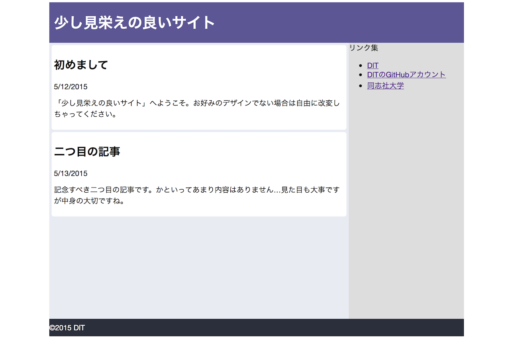

# ブログ風のレイアウト
## サイトの構成

次のスクリーンショットをみてください．

これはブログを想定したWebサイトの例です．
上記のように複数の部分に分けられます．
その代表的なものは以下の通りです．

* ヘッダー: ページに表示されるヘッダー．ブログならブログ名など．サイト全体の名前が入ります．```<head>```タグと同じものではないので注意．
* サイドバー: 他のページへのリンクの集まり．ブログなら記事のカテゴリーの一覧などがあります．左側に置かれることもあります．
* 中心となるコンテンツ: この部分を表す言葉の選択に迷いました．スクリーンショットのなかでは一番大きくて上の方に「タイトル」と書かれた部分です．表示している記事そのものが入る部分です．
* フッター: ページに表示されるフッター．細かい文字での説明やメッセージの署名などが入ります．

このサイトの構造を指定したのが次のHTMLのコードになります．  
骨組みだけを書いておきますので中身は考えて書いてみてください．

### index.html

```
<!DOCTYPE html>
<html>
<head>
  <meta charset="utf-8">
  <title>タイトル</title>
</head>
<body>
  <div class="wrapper">
    ...この部分のHTMLは書いてください．
  </div>
</body>
</html>
```

上記の```wrapper```は「サイトを包むもの」という意味です．
```margin: auto```で中央揃えにするのに必要となります．
```margin: auto```に関しては下記の補足にあります．  
なお．後で必要となる各```<div>```のclassはここで指定しておきます． 

* ヘッダー: ```class="header"```
* サイドバー: ```class="sidebar"```  
* 中心となるコンテンツ: ```class="main"```  
* フッター: ```class="footer"```

ここまで完成させてブラウザで確認してみても．想定の配置にはなりません．
これはCSSでレイアウトを指定していないからです．次にその指定を行います．

## CSSを使用してレイアウトを指定しよう

上のスクリーンショットと同様のレイアウトになるようにstyle.cssを書いていきましょう．
HTMLのファイルに```<link>```タグでstyle.cssを追加してください．

### style.css

```css
.wrapper {
  width: 900px;
  margin: 0 auto;
}
/*続く*/

```
この続きは考えて書いてみてください．
ブラウザで確認をしながら記述すると良いでしょう．
上のスクリーンショットにおける各要素の厳密な大きさや色を以下に記します．

* ヘッダー
    * padding: 20px
    * 背景色: #eee
* サイドバー
    * 横幅: 250px
    * 高さ: 600px
    * 背景色: #ddd
* メインの部分
    * 横幅: 650px
    * 高さ: 600px
    * 背景色: #fbfbfb
* フッター:
    * padding: 10px
    * 背景色: #eee  

### 補足説明
#### margin: 0 autoについて

上の書きかけのCSSに```margin: 0 auto```がありますが．ここでその説明を少し加えておきます．
幅が指定された```<div>```に対して```margin: 0 auto```と書くと．上下の```margin```を0にし．左右の```margin```を均等な値にするように指定できます．
こうすることによって．幅の指定された```<div>```の位置を中央揃えにすることができます．

#### floatとclearについて

スクリーンショットではサイトバーが中心となるコンテンツの右側に回り込んでいます．
本来．```<div>```は下へ下へと追加されていくのですが．```float```を使うことでこれを横に回り込ませることができます．
以下の指定の仕方があります．

* ```float: left```  
指定した```<div>```を左詰めにして．次の```<div>```をその右側に回り込ませることができます．
* ```float: right```  
指定した```<div>```を右詰めにして．次の```<div>```をその左側に回り込ませることができます． 

また．上記の回り込みを防ぎたい場合は．回り込んでほしくない```<div>```に```clear```を指定します．```clear```にもいくつかの指定の仕方があります．

* ```clear: left```  
```float: left```を指定した```<div>```に対する回り込みを無効化します．
* ```clear: right```  
```float: right```を指定した```<div>```に対する回り込みを無効化します．
* ```clear: both```  
上記の二つを両方同時に指定する方法です．  

```float```を使用した後は必ず```clear```を指定しておきましょう．そうしないとレイアウトが崩れてしまうことがあります．

本日の本編は以上です．余裕のある方は次の発展課題に進んでください．

##発展課題
上のスクリーンショットで使われている色は白と数種類の灰色と味気ないですね．
もう少し見栄えの良いものにしてみましょう．一例として参考画像を載せておきます．



それぞれの好みに合わせて上で作ったものを書き換えてみましょう．
各種色の指定は．色の名前で指定するほか「カラーコード」で指定することもできます．
下記のサイトは指定した色に対するカラーコードを出してくれるものです．ご活用ください．

[colourcode](http://colourco.de/ "colourcode") 
[前へ ブログ風のレイアウト](../03/basic_bloglike_layout.md)
 
[次へ HTML, CSSの総まとめ](../04/html-css.md)
 
[前へ レスポンシブデザインの作り方](../../spring/02/how_to_design_responsively.md)
 
[次へ HTML, CSSの総まとめ](../../spring/04/html-css.md)
 
[前へ レスポンシブデザインの作り方](../../spring/02/how_to_design_responsively.md)
 
[次へ HTML, CSSの総まとめ](../../spring/04/html-css.md)
 
[前へ レスポンシブデザインの作り方](../../spring/02/how_to_design_responsively.md)
 
[次へ HTML, CSSの総まとめ](../../spring/04/html-css.md)
 
[前へ レスポンシブデザインの作り方](../../spring/02/how_to_design_responsively.md)
 
[次へ HTML, CSSの総まとめ](../../spring/04/html-css.md)
